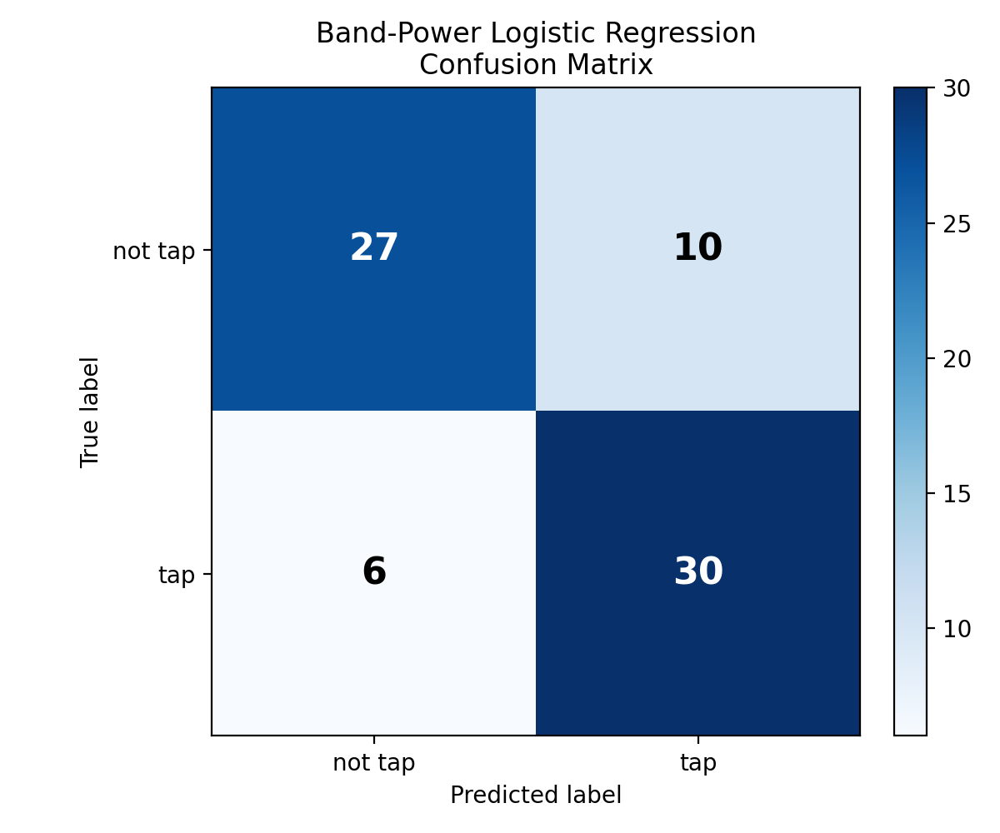

# iEEG Analysis Journey: Band Power and Generalization

## Short Description

This project is Part 2 of my iEEG analysis journey.

In Part 1, my first logistic regression model failed when I used raw `channels x time` voltage windows. In this part, I redesigned the model using frequency-band power features, then tested whether the improvement generalized to other recordings.

The result was more realistic than perfect: the band-power model improved performance on one recording, but it did not generalize well across unseen recordings.

## Dataset

This project uses the OpenNeuro dataset `ds005931`, **Visuomotor_task**.

Dataset DOI: `https://doi.org/10.18112/openneuro.ds005931.v1.0.0`  
License: `CC0`

Raw data are not included in this repository. The code expects the dataset to be downloaded separately.

## Project Question

```text
Can frequency-band power features improve tap-vs-not-tap classification,
and do those features generalize to new iEEG recordings?
```

## Stage 3: Band-Power Features

Instead of feeding the model every voltage value, I summarized each window using average power in standard frequency bands.

This stage continues from Part 1, where `X_all` contains tap and not-tap windows and `y_all` contains their labels.

| Band | Frequency Range |
| --- | --- |
| Theta | 4-8 Hz |
| Alpha | 8-13 Hz |
| Beta | 13-30 Hz |
| Gamma | 30-80 Hz |
| High gamma | 80-150 Hz |

This makes the model easier to interpret because each feature has a neuroscience meaning.

```python
import numpy as np
from scipy.signal import welch


frequency_bands = {
    "theta": (4, 8),
    "alpha": (8, 13),
    "beta": (13, 30),
    "gamma": (30, 80),
    "high_gamma": (80, 150),
}


def extract_band_power_features(X, sfreq, frequency_bands):
    features = []

    for trial in X:
        trial_features = []

        # trial shape: channels x time_points.
        freqs, psd = welch(trial, fs=sfreq, axis=1)

        for band_name, (fmin, fmax) in frequency_bands.items():
            freq_mask = (freqs >= fmin) & (freqs <= fmax)
            band_power = psd[:, freq_mask].mean()
            trial_features.append(band_power)

        features.append(trial_features)

    return np.array(features)
```

## Band-Power Logistic Regression

The new model used only five features per example:

```text
theta, alpha, beta, gamma, high_gamma
```

```python
from sklearn.model_selection import train_test_split
from sklearn.preprocessing import StandardScaler
from sklearn.linear_model import LogisticRegression
from sklearn.pipeline import make_pipeline
from sklearn.metrics import accuracy_score, classification_report, confusion_matrix


X_features = extract_band_power_features(X_all, sfreq=1000, frequency_bands=frequency_bands)

X_train, X_test, y_train, y_test = train_test_split(
    X_features,
    y_all,
    test_size=0.2,
    random_state=42,
    stratify=y_all,
)

# StandardScaler makes the band-power columns more comparable.
model = make_pipeline(
    StandardScaler(),
    LogisticRegression(max_iter=1000),
)

model.fit(X_train, y_train)
y_pred = model.predict(X_test)

print("Accuracy:", accuracy_score(y_test, y_pred))
print("Confusion matrix:")
print(confusion_matrix(y_test, y_pred, labels=[0, 1]))
print(classification_report(y_test, y_pred, target_names=["not_tap", "tap"], zero_division=0))
```

## Single-Recording Result

On the same recording used in Part 1, the band-power model improved substantially.

| Model | Feature Representation | Accuracy |
| --- | --- | --- |
| First logistic regression | Raw `channels x time` voltage windows | ~49% |
| Improved logistic regression | Frequency-band power | ~78.1% |

The confusion matrix was:

```text
[[27 10]
 [ 6 30]]
```

This means:

- 27 not-tap windows were correctly classified as not tap
- 10 not-tap windows were incorrectly classified as tap
- 6 tap windows were incorrectly classified as not tap
- 30 tap windows were correctly classified as tap



## Stage 4: Testing Generalization

The single-recording result was encouraging, but it raised a harder question:

```text
Does the model work on recordings it has never seen before?
```

To test that, I expanded the dataset across other sessions and subjects.

The full dataset builder creates one table with this structure:

```text
subject | session | file | theta | alpha | beta | gamma | high_gamma | label
```

The full scripts are:

- [04_build_full_band_power_dataset.py](../scripts/04_build_full_band_power_dataset.py)
- [05_train_full_band_power_classifier.py](../scripts/05_train_full_band_power_classifier.py)

## Generalization Result

When I tested the band-power model across more recordings, performance dropped back near chance.

| Evaluation | Accuracy | Interpretation |
| --- | --- | --- |
| Random split across all examples | ~48.0% | The model did not learn a reliable rule across the larger dataset. |
| Held-out recording split | ~49.4% | The model did not generalize to recordings it had never seen before. |

The held-out recording confusion matrix was:

```text
[[295 378]
 [303 370]]
```

This means the model was almost equally confused between tap and not-tap examples.

## What I Learned

Part 2 taught me that improving accuracy on one recording is not the same as building a model that generalizes.

The band-power features were useful inside one recording, but the model did not hold up across new recordings. That suggests the classifier may have learned recording-specific patterns rather than a general tap-vs-not-tap signature.

This is still a strong result for learning because it shows the difference between:

```text
single-recording performance
```

and:

```text
generalization to unseen neural recordings
```

## Next Steps

- Improve normalization across recordings.
- Save Part 2 classification reports and confusion matrices as result files.
- Compare band-power features with other feature types.
- Try session-aware and subject-aware validation.
- Only move to neural networks or transformers after the feature-based baseline is understood.
