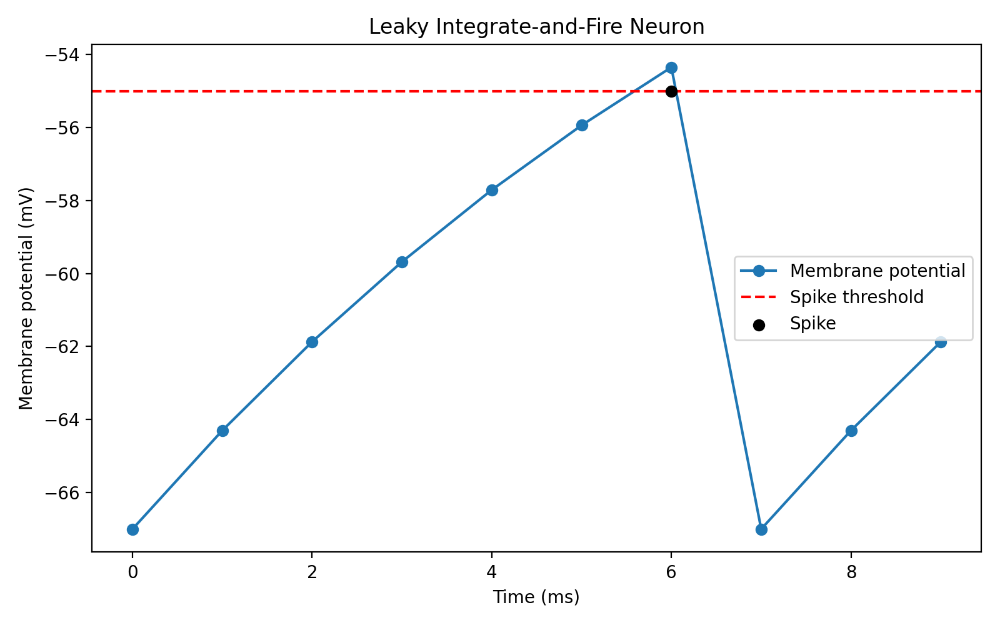

# Single Neuron Simulation

## Short Description

This project simulates a simple **leaky integrate-and-fire neuron** in Python.

The neuron starts at a resting membrane potential. At each time step, input current pushes the voltage upward while leak pulls it back toward rest. If the voltage reaches a threshold, the neuron spikes and resets.

This project helped me practice Python functions, loops, lists, plotting with `matplotlib`, and connecting code to a computational neuroscience concept.

## What The Code Shows

- how membrane voltage changes over time
- how leak pulls voltage back toward rest
- how a spike threshold works
- how spike times can be stored
- how to save a voltage-trace figure

## Main Code

```python
import matplotlib.pyplot as plt

V_rest = -70
V = V_rest
threshold = -55
input_current = 3
dt = 1
steps = 10

time_points = []
V_trace = []
spike_times = []

for step in range(steps):
    time = step * dt
    time_points.append(time)

    leak = 0.1 * (V_rest - V)

    V = V + leak + input_current
    V_trace.append(round(V, 2))

    if V >= threshold:
        print("Spike at", time, "ms")
        spike_times.append(time)
        V = V_rest
    else:
        print("No spike at", time, "ms")

print("Time points:", time_points)
print("Voltage trace:", V_trace)
print("Spike times:", spike_times)

plt.plot(time_points, V_trace, marker="o")
plt.axhline(threshold, color="red", linestyle="--", label="Threshold")
plt.scatter(spike_times, [threshold] * len(spike_times), color="black", label="Spike")

plt.xlabel("Time (ms)")
plt.ylabel("Membrane potential (mV)")
plt.title("Leaky Integrate-and-Fire Neuron")
plt.legend()
plt.show()
```
## Example Output

The script prints whether the neuron spikes at each time step and saves this plot:


