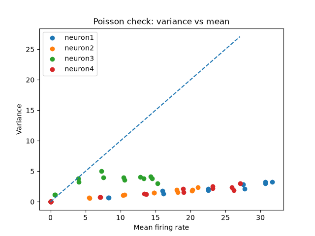
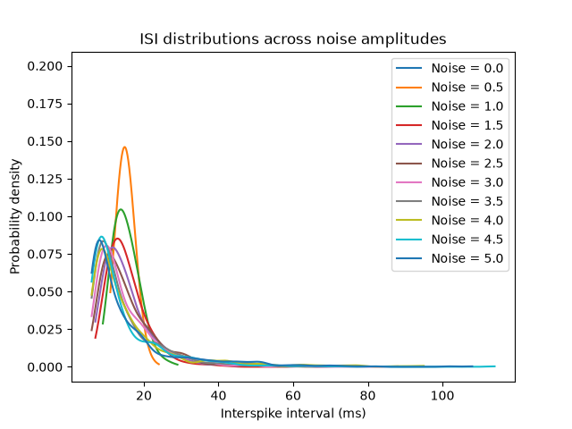
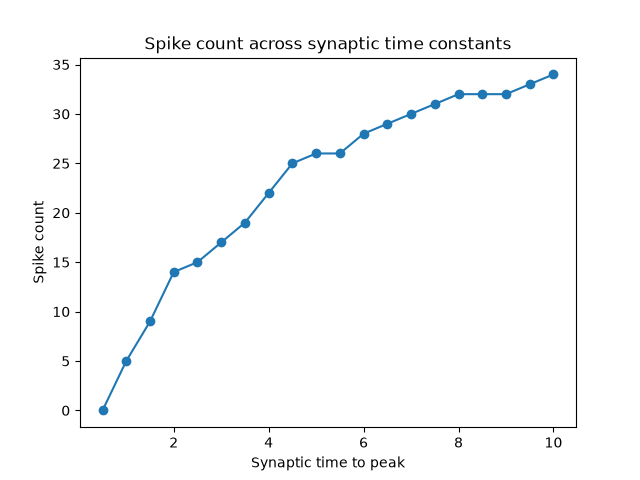
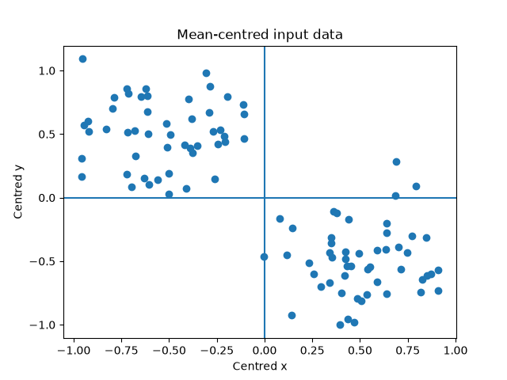

# University of Washington Computational Neuroscience Course Models

## Short Description

This project collects selected Python models I built while working through the University of Washington online computational neuroscience course.

Instead of showing every small test file, I grouped the strongest work into four themes:

- neural coding and population decoding
- membrane dynamics and spiking models
- synaptic input and spike-rate adaptation
- eigenvectors and learning from input structure

These models show my progress using Python, `numpy`, `matplotlib`, and course datasets to explore computational neuroscience ideas.

---

## 1. Neural Coding and Population Decoding

This section combines two related ideas:

- checking whether neural firing variability looks Poisson-like
- using a population vector to decode a stimulus direction

Together, these scripts show how neural responses can be analyzed statistically and then used to estimate information about a stimulus.

### Poisson Variability Check

```python
import pickle
import matplotlib.pyplot as plt
import numpy as np

with open('tuning_3.4.pickle', 'rb') as f:
    data = pickle.load(f)

# Store all means and variances so the reference line fits the whole plot.
all_means = []
all_vars = []

for neuron in ['neuron1', 'neuron2', 'neuron3', 'neuron4']:
    # Compare average firing rate with trial-to-trial variability.
    mean_fire = np.mean(data[neuron], axis=0)
    var_fire = np.var(data[neuron], axis=0)
    all_means.extend(mean_fire)
    all_vars.extend(var_fire)

    plt.scatter(mean_fire, var_fire, label=neuron)

max_axis = max(max(all_means), max(all_vars))
plt.plot([0, max_axis], [0, max_axis], '--')
plt.xlabel('Mean firing rate')
plt.ylabel('Variance')
plt.title('Poisson check: variance vs mean')
plt.legend()
plt.show()
```

### Population Vector Decoding

```python
import pickle
import numpy as np

with open('pop_coding_3.4.pickle', 'rb') as f:
    datap = pickle.load(f)

with open('tuning_3.4.pickle', 'rb') as f:
    data = pickle.load(f)

# Estimate each neuron's maximum response from the tuning data.
rmax1 = np.max(np.mean(data['neuron1'], axis=0))
rmax2 = np.max(np.mean(data['neuron2'], axis=0))
rmax3 = np.max(np.mean(data['neuron3'], axis=0))
rmax4 = np.max(np.mean(data['neuron4'], axis=0))

# Average the observed responses during the test stimulus.
r1 = np.mean(datap['r1'])
r2 = np.mean(datap['r2'])
r3 = np.mean(datap['r3'])
r4 = np.mean(datap['r4'])

# Build the population vector by weighting each preferred direction.
v = (r1 / rmax1) * datap['c1'] \
    + (r2 / rmax2) * datap['c2'] \
    + (r3 / rmax3) * datap['c3'] \
    + (r4 / rmax4) * datap['c4']

angle = np.degrees(np.arctan2(v[1], v[0]))
angle = angle % 360

print("population vector:", v)
print("angle:", round(angle))
```

**Why this is worth showing:**  
This is one of the most direct links between neural data and computation: responses from multiple neurons are combined to decode information.

---

## 2. Membrane Dynamics and Spiking Models

This section combines passive membrane charging, integrate-and-fire dynamics, and noisy spike timing.

The core idea is that a neuron's voltage changes over time according to input current, leak, threshold, reset, and noise.

### Passive Membrane Time Constant

```python
import numpy as np
import matplotlib.pyplot as plt

I = 10  # nA
C = 0.1  # nF
R = 100  # M ohms

# The theoretical time constant comes from the membrane equation.
tau_theoretical = R*C

print("C =", C, "nF")
print("R =", R, "M ohms")
print("tau =", tau_theoretical, "ms")
print('(Theoretical)')

tstop = 150
V_inf = I*R
tau_experimental = None
h = 0.2
V = 0
V_trace = [V]
time_points = [0]

# Simulate how the membrane voltage charges over time.
for t in np.arange(h, tstop, h):
    V = V + h*(- (V/(R*C)) + (I/C))

    # The experimental tau is when voltage reaches about 63.2% of its final value.
    if tau_experimental is None and V > 0.6321*V_inf:
        tau_experimental = t
        print("tau =", round(tau_experimental, 3), "ms")
        print('(Experimental)')

    if t >= 0.6*tstop:
        I = 0

    V_trace += [V]
    time_points += [t]

plt.plot(time_points, V_trace)
plt.xlabel("Time (ms)")
plt.ylabel("Membrane voltage")
plt.title("Passive membrane charging")
plt.show()
```

### Integrate-and-Fire Neuron

```python
import numpy as np
import matplotlib.pyplot as plt

I = 10
C = 1
R = 40

V = 0
tstop = 200
abs_ref = 5
ref = 0
V_trace = []
time_points = []
V_th = 10

# Simulate voltage, threshold crossing, and refractory reset.
for t in range(tstop):

    if not ref:
        V = V - (V/(R*C)) + (I/C)
    else:
        ref -= 1
        V = 0.2 * V_th

    if V > V_th:
        V = 50
        ref = abs_ref

    V_trace += [V]
    time_points += [t]

plt.plot(time_points, V_trace)
plt.xlabel("Time step")
plt.ylabel("Voltage")
plt.title("Integrate-and-fire neuron")
plt.show()
```

### Noise and Interspike Intervals

```python
import numpy as np
import matplotlib.pyplot as plt

np.random.seed(0)

C = 1
R = 40
tstop = 10000
abs_ref = 5
V_th = 10
baseline_I = 1

noise_values = np.arange(0, 5.5, 0.5)

# Run the same neuron model with increasing noise amplitudes.
for noiseamp in noise_values:

    V = 0
    ref = 0
    spiketimes = []
    I = baseline_I + noiseamp * np.random.normal(0, 1, tstop)

    for t in range(tstop):

        if ref == 0:
            V = V - V / (R * C) + I[t] / C
        else:
            ref -= 1
            V = 0.2 * V_th

        if V > V_th:
            V = 50
            ref = abs_ref
            spiketimes.append(t)

    isi = np.diff(spiketimes)

    # Plot a smoothed distribution only if the neuron produced enough spikes.
    if len(isi) >= 2:
        x = np.linspace(isi.min(), isi.max(), 300)
        y = np.zeros_like(x)
        bandwidth = 2

        for value in isi:
            y += np.exp(-0.5 * ((x - value) / bandwidth) ** 2)

        y = y / (len(isi) * bandwidth * np.sqrt(2 * np.pi))
        plt.plot(x, y, label=f"Noise = {noiseamp:.1f}")

plt.xlabel("Interspike interval (ms)")
plt.ylabel("Probability density")
plt.title("ISI distributions across noise amplitudes")
plt.legend()
plt.show()
```

**Why this is worth showing:**  
These models form a clear progression: passive voltage change, threshold spiking, then noisy spike timing.

---

## 3. Synaptic Input and Spike-Rate Adaptation

This model is one of the strongest pieces in the folder because it goes beyond a single current input.

It uses:

- a random input spike train
- alpha-function synaptic conductance
- excitatory synaptic current
- refractory periods
- spike-rate adaptation
- spike count as an output measure

```python
import numpy as np
import matplotlib.pyplot as plt

np.random.seed(0)
h = 1.
t_max = 200
tstop = int(t_max/h)

thr = 0.9
spike_train = np.random.rand(tstop) > thr

t_a = 100
t_peak_values = np.arange(0.5, 10.5, 0.5)
g_peak = 0.05
t_vec = np.arange(0, t_a + h, h)

C = 0.5
R = 40
G_inc = 1/h
tau_ad = 2

E_leak = -60
E_syn = 0
V_th = -40
V_spike = 50
ref_max = int(4/h)

fig, axs = plt.subplots(2, 1)
axs[0].plot(np.arange(0, t_max, h), spike_train)
axs[0].set_title('Input spike train')

spike_counts = []

# Test how changing the synaptic time-to-peak changes output spiking.
for t_peak in t_peak_values:

    const = g_peak / (t_peak * np.exp(-1))
    alpha_func = const * t_vec * np.exp(-t_vec / t_peak)

    V = E_leak
    g_ad = 0
    t_list = np.array([], dtype=int)
    spike_count = 0
    ref = 0

    V_trace = [V]
    t_trace = [0]

    for t in range(tstop):

        # A new input spike starts at age 0 in the alpha-function lookup.
        if spike_train[t]:
            t_list = np.concatenate([t_list, [0]])

        # Sum the conductance from all active input spikes.
        g_syn = np.sum(alpha_func[t_list])
        I_syn = g_syn*(E_syn - V)

        # Age all active spikes and remove the ones beyond the alpha window.
        if t_list.size > 0:
            t_list = t_list + 1
            t_list = t_list[t_list <= t_a]

        if not ref:
            V = V + h*(-((V-E_leak)*(1+R*g_ad)/(R*C)) + (I_syn/C))
            g_ad = g_ad + h*(-g_ad/tau_ad)
        else:
            ref -= 1
            V = V_th - 10
            g_ad = g_ad + h*(-g_ad/tau_ad)

        if (V > V_th) and not ref:
            V = V_spike
            spike_count += 1
            ref = ref_max
            # Increase adaptation after an output spike.
            g_ad = g_ad + G_inc

        V_trace += [V]
        t_trace += [(t + 1)*h]

    spike_counts.append(spike_count)

plt.figure()
plt.plot(t_peak_values, spike_counts, marker="o")
plt.xlabel("Synaptic time to peak")
plt.ylabel("Spike count")
plt.title("Spike count across synaptic time constants")

axs[1].plot(t_trace, V_trace)
axs[1].set_title('Output voltage trace')
plt.show()

print("Spike Count:", spike_counts)
```

**Why this is worth showing:**  
This model demonstrates a richer neuron simulation with synaptic inputs and adaptation, which looks more advanced than a basic integrate-and-fire script.

---

## 4. Eigenvectors and Learning From Input Structure

This section combines the input-correlation eigenvector script with the centered-data learning script.

The shared idea is that a system can learn or identify important directions in input data.

```python
import pickle
import matplotlib.pyplot as plt
import numpy as np

with open('c10p1.pickle', 'rb') as f:
    data = pickle.load(f)

points = data["c10p1"]

# Center the data so the learning rule focuses on structure, not the mean.
mean_point = np.mean(points, axis=0)
u = points - mean_point

print("Mean after centering:", np.mean(u, axis=0))

plt.scatter(u[:, 0], u[:, 1])
plt.axhline(0)
plt.axvline(0)
plt.xlabel("Centred x")
plt.ylabel("Centred y")
plt.title("Mean-centred input data")
plt.show()

eta = 1
dt = 0.01
num_iterations = 100_000

w = np.random.rand(2)
w = w / np.linalg.norm(w)
num_points = len(u)

# Repeatedly update the weight vector using centered input samples.
for t in range(num_iterations):
    index = t % num_points
    current_u = u[index]
    v = current_u @ w

    # Oja's rule keeps the weight vector from growing without bound.
    delta_w = dt*eta * (v * current_u - (v**2) * w)
    w = w + delta_w

print("Final weight vector:", w)
print("Length of final vector:", np.linalg.norm(w))

Q = np.cov(u.T)

# Compare the learned direction to the principal eigenvector of the data.
vals, vecs = np.linalg.eig(Q)
principal_eigenvector = vecs[:, np.argmax(vals)]

print("Principal eigenvector:", principal_eigenvector)
print("Length of final weight vector:", np.linalg.norm(principal_eigenvector))
```


**Why this is worth showing:**  
It connects neural learning rules to linear algebra and data structure, which is a valuable computational neuroscience theme.

---
